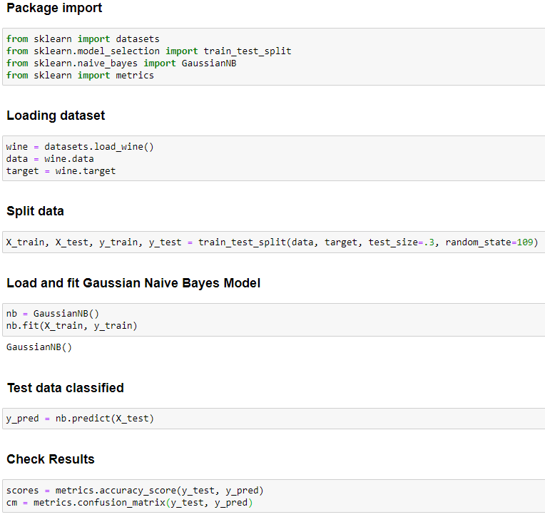

# Naive-Bayes-Classifier

#### Solweig Hennechart
Presentation of the Naive Bayes classifier for M1 bioinformatics students

#### Introduction

The Naive Bayes Classifier is a supervised classifier based on bayes’ Theorem.

A classifier with supervised learning is a model that requires an already categorized training data set. (Refer to [Supervised, Unsupervised methods, Training and Test dataset](https://moodle1.u-bordeaux.fr/mod/wiki/view.php?pageid=3928) Block #1).

Bayes' theorem is a conditional probabilistic theorem. It calculates the probability of an event conditioned by another. (Refer to [Bayes Theorem](https://moodle1.u-bordeaux.fr/mod/wiki/view.php?pageid=3943) Block #3)

Bayes' theorem is unusable as a classifier due to the complexity of the computation when the number of attributes becomes large. It’s why we need the naive adaptation.

#### Naive Bayes Theorem

##### <u>Presentation</u>

This variant of Bayes' theorem is based on a strong hypothesis of independence between the attributes. 

\( P(A_1|C,A_2,A_3...A_n) = P(A_1|C) \)  

With this assumption it is possible to calculate the probability of each attribute independently of the others. This greatly simplifies the calculation.

\( p(C|A_1,A_2,...,A_n) = \frac{P(C) \times P(A_1,A_2,...,A_n|C) }{P(A_1,A_2,...,A_n)} \Leftrightarrow \frac{P(C) \times P(A_1|C) \times P(A_2|C) \times P(A_n|C) }{P(A_1,A_2,...,A_n)}\Leftrightarrow \frac{P(C) \times \Pi_{i=1}^{n}{P(A_i|C)} }{P(A_1,A_2,...,A_n)} \)  

  

Note that (P(A_1,A_2,...,A_n)) is not dependent on the class, so it should not be calculated each time (for each class) it is also not essential to calculate it to do prediction because this is based on a comparison of the results of each class.  

##### Probabilities compute

There are several formulas for calculating probabilities that I will not expand here because they depend on the data. In the case of quantitative data which seem to follow a normal distribution, we will apply Gaussian Naive Bayes.

\( P(x_i|y)= \frac{1}{ \sqrt{2 \pi \sigma^2 } }exp(- \frac{(x_i- \mu_y)^2 }{2 \sigma_y^2 }) \)  

Where μ is the mean and σ the standard deviation.  

(To know more I invite you to go to this page: [https://scikit-learn.org/stable/modules/naive_bayes.html](https://scikit-learn.org/stable/modules/naive_bayes.html))

#### Implementation

<table><caption>Wine Dataset</caption>

<tbody>

<tr>

<th scope="row" style="border-width:1px;border-style:solid;">Classes</th>

<td style="border-width:1px;border-style:solid;">3</td>

</tr>

<tr>

<th scope="row" style="border-width:1px;border-style:solid;">Samples per class</th>

<td style="border-width:1px;border-style:solid;">[59,71,48]</td>

</tr>

<tr>

<th scope="row" style="border-width:1px;border-style:solid;">Samples total</th>

<td style="border-width:1px;border-style:solid;">178</td>

</tr>

<tr>

<th scope="row" style="border-width:1px;border-style:solid;">Dimensionality</th>

<td style="border-width:1px;border-style:solid;">13</td>

</tr>

<tr>

<th scope="row" style="border-width:1px;border-style:solid;">Features  
</th>

<td style="border-width:1px;border-style:solid;">Quantitatives</td>

</tr>

<tr>

<th scope="row" style="border-width:1px;border-style:solid;">Missing Data</th>

<td style="border-width:1px;border-style:solid;"> 0</td>

</tr>

</tbody>

</table>

##### How does it works ?

<u>1- DATA : </u>

Load the data, preprocess the data (impossible to use this model with missing data), split the data set into at least 2 subgroups (train and test datasets).

<u>2- TRAIN : </u>

On train data, for each class : 

Compute mean and standard deviation and also compute the class probability independently of attributs ( P(C)).

<table style="width:100%;"><caption style="text-align:center;caption-side:top;">Train Results</caption>

<thead>

<tr>

<th scope="col" style="border-width:1px;border-style:solid;">**Class**</th>

<th scope="col" style="border-width:1px;border-style:solid;">**P(Class)**</th>

<th scope="col" style="border-width:1px;border-style:solid;">**mean A1|Class**</th>

<th scope="col" style="border-width:1px;border-style:solid;">**STR A1|Class**</th>

<th scope="col" style="border-width:1px;border-style:solid;">**...**</th>

<th scope="col" style="border-width:1px;border-style:solid;">**mean A13**</th>

<th scope="col" style="border-width:1px;border-style:solid;">**STR A13**</th>

</tr>

</thead>

<tbody>

<tr>

<td style="border-width:1px;border-style:solid;">Class_0</td>

<td style="border-width:1px;border-style:solid;">P(Class=Class_0)</td>

<td style="border-width:1px;border-style:solid;">MeanA1|Class_0</td>

<td style="border-width:1px;border-style:solid;">STRA1|Class_0</td>

<td style="border-width:1px;border-style:solid;">...</td>

<td style="border-width:1px;border-style:solid;">MeanA13|Class_0</td>

<td style="border-width:1px;border-style:solid;">STRA13|Class_0</td>

</tr>

<tr>

<td style="border-width:1px;border-style:solid;">Class_1</td>

<td style="border-width:1px;border-style:solid;">P(Class=Class_1)</td>

<td style="border-width:1px;border-style:solid;">MeanA1|Class_1</td>

<td style="border-width:1px;border-style:solid;">STRA1|Class_1</td>

<td style="border-width:1px;border-style:solid;">...</td>

<td style="border-width:1px;border-style:solid;">MeanA13|Class_0</td>

<td style="border-width:1px;border-style:solid;">STRA13|Class_1</td>

</tr>

<tr>

<td style="border-width:1px;border-style:solid;">Class_2</td>

<td style="border-width:1px;border-style:solid;">P(Class=Class_2)</td>

<td style="border-width:1px;border-style:solid;">MeanA1|Class_2</td>

<td style="border-width:1px;border-style:solid;">STRA1|Class_2</td>

<td style="border-width:1px;border-style:solid;">...</td>

<td style="border-width:1px;border-style:solid;">MeanA13|Class_0</td>

<td style="border-width:1px;border-style:solid;">STRA13|Class_2</td>

</tr>

</tbody>

</table>

<u>3- PREDICTION:</u>

For all items of the test dataset (one item is one values combination for the 13 attributes) each class probabilities are computed (with Gaussian Naive formula) and compared. These probabilities depend on training step results, and are equivalent to a comparison of item’s attribute values to training step results of the same attribute.  The predicted class is the class with the better probability. 

##### Python Implementation<

ScikitLearn is a python library used for machine learning. The [wine dataset](https://scikit-learn.org/stable/modules/generated/sklearn.datasets.load_wine.html?highlight=wine) that I used here is one of the dataset in this library. You will find the [complete implementation](https://github.com/solweigH/Naive-Bayes-Classifier/blob/main/Wine.ipynb) made for this presentation of the naive bayes classifier, and below the main script.  

  

##### Result

The results are pretty good, (refer to [Model Evaluation Metrics](https://moodle1.u-bordeaux.fr/mod/wiki/view.php?pageid=3910) Block #1).

  

  

Yet, as a biologist, one can easily question the independence of the attributes in this case (with wine's attributs). Although in reality the features are not independent, this classifier is still effective.  

#### References

[https://en.wikipedia.org/wiki/Naive_Bayes_classifier](https://en.wikipedia.org/wiki/Naive_Bayes_classifier)  

[https://scikit-learn.org](https://scikit-learn.org)  

The Master of Algorithm by Pedro Domingos, 2015\. Chapter 6.   

UE 4TYE903U, IA & Données (Akka Zemmari).
